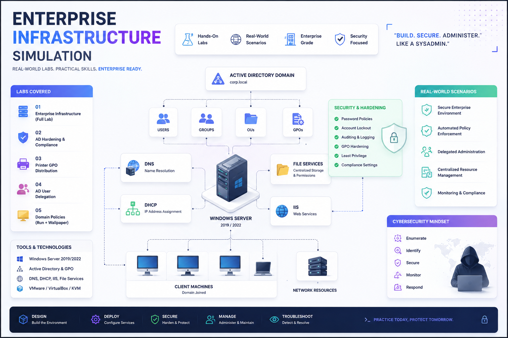

# Windows Server Administration Labs

> > A structured collection of hands-on Windows Server administration labs focused on Active Directory, Group Policy, infrastructure services, and enterprise management scenarios.

  

---
##  Overview

This repository contains a collection of practical Windows Server administration labs designed to simulate real-world enterprise environments.

Each lab focuses on a specific administrative task commonly performed by System Administrators and Infrastructure Engineers, providing hands-on experience in deploying, managing, securing, and troubleshooting Windows Server environments.

---
## 🎯 What You Will Find

-  Active Directory deployment & administration
-  User, Group, and OU management
-  Security hardening using Group Policy
-  Infrastructure services (DNS, DHCP, IIS, File Services)
-  Delegated administration & least privilege
-  Enterprise resource deployment using GPO
-  Real-world administrative scenarios

---
## 🗂️ Labs Structure 

### 🖥️ Windows Server Labs

| #   | Lab Name                             | Key Concepts                                                                 |
| --- | ------------------------------------ | ---------------------------------------------------------------------------- |
| 01  | Enterprise Infrastructure (Full Lab) | Full environment setup including AD, DHCP, DNS, IIS, File Server, and Backup |
| 02  | AD Hardening & Compliance            | Automate printer deployment using Group Policy                               |
| 03  | Printer GPO Distribution             | Automated Resource Deployment                                                |
| 04  | AD User Delegation                   | Implement least privilege and delegated administration                       |
| 05  | Domain Policies (Run + Wallpaper)    | Enforce environment-wide restrictions and standardization                    |

---
## 🛠️ Technologies Used

- Windows Server 2019 / 2022
- Active Directory Domain Services (AD DS)
- Group Policy (GPO)
- DNS / DHCP / IIS / File Services
- VMware / VirtualBox / KVM

---

## 🧠 Skills Demonstrated

- Windows Server Administration
- Active Directory Management
- Group Policy Administration
- Infrastructure Services Management
- Security Hardening
- Delegated Administration
- Enterprise Policy Enforcement
- Troubleshooting & Problem Solving

---

## Lab Previews

**Enterprise Infrastructure (Full Lab)**
 

  

**AD Hardening & Compliance :**
 

  

**🖨️ Printer GPO Distribution :**
 

  

**AD User Delegation :**
 

  

**Domain Policies (Run + Wallpaper) :**
 

  

---
##  Contact

If you have any questions or feedback, feel free to reach out:

---
## ⭐ Support

If you find this repository helpful, consider giving it a ⭐ — it really helps!